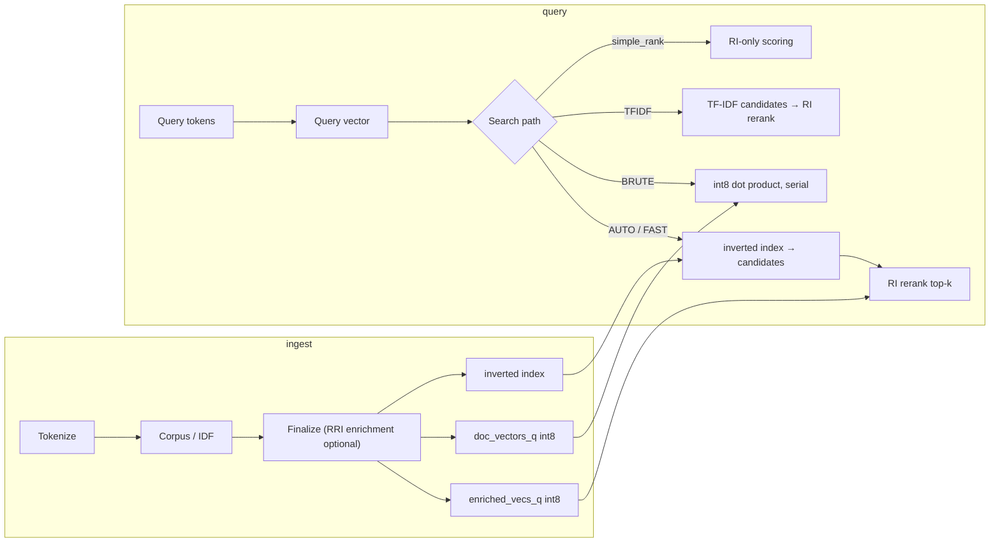

# Overview and Architecture

## Architecture overview

**Current state:** All doc vectors and enriched vocabulary vectors are int8.
`doc_vectors_q_inv_mag` stores per-doc reciprocal magnitudes. Brute-force is
static-chunked parallel (default `total_cores / 4`, ~3 ms; configurable via `FCE_BRUTE_WORKERS`). Fast/tfidf paths use inverted
index candidates + RI rerank. Search path is configurable via
`fce_query_mode_t` in `fce_sem_config_t` (AUTO, BRUTE, FAST, TFIDF).

**RRI enrichment is optional and off by default.** Finalize normally writes the
normalized pretrained nomic vectors straight into `enriched_vecs_q`; IDF
weighting and mean-centering still apply. The two Reflective Random Indexing
passes (co-occurrence blending) run only when enabled via
`fce_sem_corpus_set_ri_enrichment(corpus, true)` (Java: `Corpus.setRiEnrichment` /
`complete(true)`) or `FCE_SEM_SKIP_RI=0`. Skipping them finalizes ~3–4× faster.

| Layer | Role | Notes |
|-------|------|-------|
| `semantic.c` | TF-IDF, RRI, scoring, ranking, corpus | Largest module; the core of the library |
| `foundation/` | Hash table, threads, platform | Reusable low-level primitives |
| `pipeline/worker_pool.c` | `parallel_for` | Spawns workers per parallel region |
| `java/…/fast_code_embed_jni.c` | JNI bridge | Handle table + exception-safe marshalling |
| `tests/test_semantic.c` | unit + regression tests | Unit and regression coverage |

---

## Performance analysis

### Hot paths (measured, 193 K docs)

| Operation | Complexity | Notes |
|-----------|------------|-------|
| `fce_sem_random_index` | O(768) lookup or O(8) sparse fallback | Pretrained int8 → float; good |
| `fce_sem_corpus_finalize` | O(tokens × window × docs) parallelized | Dominates ingest; int8 pipeline complete |
| `fce_sem_search_query` (default; BRUTE) | O(N × 768) | 3–5 ms; RAM-bandwidth floor; exhaustive reference |
| `fce_sem_search_query_fast` (inverted index) | O(N_inverted + k×768) | 1–3 ms; architectural recall limit (1.2/10 overlap) |
| `fce_sem_search_query_tfidf` | O(N_inverted + k×768) | 1–2 ms; same recall limitation |
| `fce_sem_search_query_bruteforce` (alias of default) | O(N × 768) | 3–5 ms; RAM-bandwidth floor |
| `fce_sem_simple_rank` | O(N × 768) | RI-only; no TF-IDF in simple/flat API |

### Memory model (large corpus)

For `V` vocabulary tokens, `D` documents (measured at 193 K docs, ~1 M vocab):

| Array | Bytes/entry | Footprint @ 193 K docs |
|-------|-------------|------------------------|
| `enriched_vecs_q` (int8, 768/token) | 768 | ~750 MB |
| `doc_vectors_q` (int8, 768/doc) | 768 | ~149 MB |
| `doc_vectors_q_inv_mag` (float32) | 4 | ~0.8 MB |
| Inverted index | — | ~67 MB (skippable via `FCE_BRUTE_ONLY` / `FCE_SEM_SKIP_INV_INDEX=1`) |

**Post-build RSS: 1.1 GB** (1.0 GB without inverted index). Peak during finalize:
~4.9 GB (transient). After `malloc_trim`: converges to live set (~1.1 GB).
Run with `make bench` to build the `bench_mem_query` benchmark tool.

The two int8 arrays above (`enriched_vecs_q`, `doc_vectors_q`) are sized by the
**active dimension**, selectable at runtime via `fce_sem_set_dim(256|768)`
(`FastCodeEmbed.setDim` in Java; `FCE_SEM_DIM=256` for the benchmark). At 256
they shrink ~3×, the dominant resident saving on a large corpus — e.g. indexing
the Linux kernel drops from ~1.2 GB to ~0.8 GB total RSS from the same binary.
256 uses a baked PCA projection (preserves ~84% variance); it trades some
ranking quality for the memory win. The projection is precomputed once over the
pretrained table (`g_pca_blob_proj`, ~42 MB, reduced-dim mode only) and then
applied per token as a cheap linear combine — so 256 finalize is only modestly
slower than 768 rather than several times slower. A cache file records its
dimension and `load` adopts it automatically.

### Retrieval quality vs. a general static embedding

For an end-to-end comparison of retrieval quality and indexing/query performance
against potion-base-8M (a general-purpose model2vec static embedding) on Linux
kernel source, see [COMPARISON-VS-POTION-BASE-8M.md](COMPARISON-VS-POTION-BASE-8M.md).

---

## Java / JNI layer

- Batch APIs (`nAddDocsBatch` with doc_map_out, `nAddDocsTokenized`, `nTokenizeBatch`,
  `nSimpleRankFlat`).
- Exception checks and cleanup labels.
- Array size validation in flat rank.
- TF-IDF index validation in `sparse_tfidf_cosine`.
- Critical native arrays used where GC pressure is a concern.
- `fce_log` is emitted on allocation failures (e.g. pass2 OOM).
- `addFiles` for reading source files, chunking by `}` boundaries, and tokenizing entirely in C.
- High-level search API: `searchQuery` (brute-force reference), `searchQueryFast`, `searchQueryTfidf`, `searchQueryBruteforce`,
  `searchCandidateCount` — each delegates to the corresponding C function with
  AUTO/BRUTE/FAST/TFIDF mode dispatch.
- Memory measurement: `getPeakRssBytes()`, `getCurrentRssBytes()`.

---

## Security considerations

- **No network attack surface** — library is fully offline; no I/O beyond file
    loading of the pretrained blob.
- **DoS via corpus size** — Partially mitigated (512 tok/doc, 1B occurrence cap).
    Host should still cap document count (`D`) and vocabulary size (`V`).
- **JNI** — Untrusted Java can pass large arrays. `nSimpleRankFlat` validates
    lengths; other entry points validate array bounds before native dispatch.
- **No secrets** in the repository; the pretrained embedding blob contains only
    public model weights (Apache 2.0).

## Build / platform support

- **C standard**: C11 (`-std=c11` in the Makefile).
- **Log macros** (`fce_log_debug/info/warn/error` in `src/foundation/log.h`):
  fold the message tag into `__VA_ARGS__` so they stay valid ISO C11 with no
  GNU extension and no `-Wpedantic` zero-variadic warning. The tree builds
  warning-clean under `-Wall -Wextra -Wpedantic` on both GCC and Clang.
- **`_Thread_local`** (used in `src/semantic/semantic.c` for scratch
  buffers, RI dequant, and candidate scratch): supported by GCC, Clang, and
  MSVC in C11 mode (`/std:c11` or `/std:c++17`). Any MSVC build would need at
  least `/std:c11`, but note MSVC is **not built or tested** (see the Windows
  note below) — the validated Windows toolchain is mingw-w64.
- **Windows: alpha / best-effort.** The library is targeted primarily at
  macOS/Linux. Windows code paths exist and are compile+link validated on every
  push by a mingw-w64 cross-compile job (`make windows-cross`), but they are
  **never executed in CI** (no Windows runner, no Wine) and the build is **mingw
  (GCC), not MSVC** — so runtime behavior and MSVC compatibility are unverified.
  No Windows binaries are shipped. Known-degraded paths include the **TLS
  destructors** (`src/semantic/semantic.c` `tls_cand_scratch` and the RI dequant
  scratch): the pthread key destructor is gated by `#ifndef _WIN32`, so on
  Windows those scratch buffers are leaked at thread exit. Treat Windows as
  read-only, single-threaded, experimental use.
- **macOS 10.12+** required for `malloc_zone_pressure_relief` (used in
  `fce_sem_corpus_finalize` to release transient memory after the final
  big allocation). Building on a newer SDK and deploying to < 10.12 will
  fail at first call to `fce_sem_corpus_finalize`.
- **`arc4random`** for hash-table seed (in `src/foundation/hash_table.c`):
  real `arc4random` on macOS, glibc ≥ 2.36, and BSDs; a `QueryPerformanceCounter`
  + process-id seed on Windows; portable `getentropy`/`clock_gettime`-based
  fallback elsewhere (with documented lower-quality seeding — sufficient for
  hash-flooding mitigation, not for crypto).