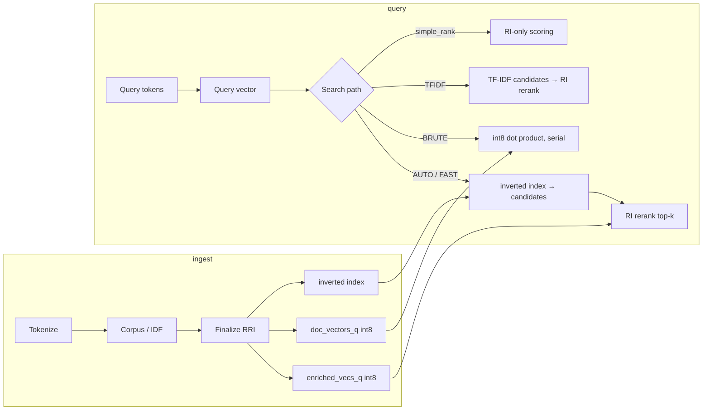

# Overview and Architecture

## Architecture overview

**Current state:** All doc vectors and enriched vocabulary vectors are int8.
`doc_vectors_q_inv_mag` stores per-doc reciprocal magnitudes. Brute-force is
static-chunked parallel (default `total_cores / 4`, ~3 ms; configurable via `FCE_BRUTE_WORKERS`). Fast/tfidf paths use inverted
index candidates + RI rerank. Search path is configurable via
`fce_query_mode_t` in `fce_sem_config_t` (AUTO, BRUTE, FAST, TFIDF).

| Layer | Role | Quality |
|-------|------|---------|
| `semantic.c` | TF-IDF, RRI, scoring, ranking, corpus | Strong; large but coherent |
| `foundation/` | Hash table, threads, platform | Clean abstractions |
| `pipeline/worker_pool.c` | `parallel_for` | Simple; thread churn (see M6) |
| `java/…/fast_code_embed_jni.c` | JNI | Above average hygiene |
| `tests/test_semantic.c` | 64 unit tests | Good coverage; gaps below |

---

## Performance analysis

### Hot paths (measured, 193 K docs)

| Operation | Complexity | Notes |
|-----------|------------|-------|
| `fce_sem_random_index` | O(768) lookup or O(8) sparse fallback | Pretrained int8 → float; good |
| `fce_sem_corpus_finalize` | O(tokens × window × docs) parallelized | Dominates ingest; int8 pipeline complete |
| `fce_sem_search_query` (AUTO/FAST) | O(N_inverted + k×768) | 1–3 ms; architectural recall limit (1.2/10 overlap) |
| `fce_sem_search_query_tfidf` | O(N_inverted + k×768) | 1–2 ms; same recall limitation |
| `fce_sem_search_query_bruteforce` | O(N × 768) | 3–5 ms; RAM-bandwidth floor |
| `fce_sem_simple_rank` | O(N × 768) | RI-only; no TF-IDF in simple/flat API |

### Memory model (large corpus)

For `V` vocabulary tokens, `D` documents (measured at 193 K docs, ~1 M vocab):

| Array | Bytes/entry | Footprint @ 193 K docs |
|-------|-------------|------------------------|
| `enriched_vecs_q` (int8, 768/token) | 768 | ~750 MB |
| `doc_vectors_q` (int8, 768/doc) | 768 | ~149 MB |
| `doc_vectors_q_inv_mag` (float32) | 4 | ~0.8 MB |
| Inverted index | — | ~67 MB (skippable via `FCE_BRUTE_ONLY` / `FCE_SEM_SKIP_INV_INDEX=1`) |

**Post-build RSS: 1.1 GB** (1.0 GB without inverted index). Peak during finalize:
~4.9 GB (transient). After `malloc_trim`: converges to live set (~1.1 GB).
Run with `make bench` to build the `bench_mem_query` benchmark tool.

---

## Java / JNI layer

- Batch APIs (`nAddDocsBatch` with doc_map_out, `nAddDocsTokenized`, `nTokenizeBatch`,
  `nSimpleRankFlat`).
- Exception checks and cleanup labels.
- Array size validation in flat rank.
- TF-IDF index validation in `sparse_tfidf_cosine`.
- Critical native arrays used where GC pressure is a concern.
- `fce_log` used on pass2 OOM; should extend to finalize failures and
  ht insert failures.
- `addFiles` for reading source files, chunking by `}` boundaries, and tokenizing entirely in C.
- High-level search API: `searchQuery`, `searchQueryTfidf`, `searchQueryBruteforce`,
  `searchCandidateCount` — each delegates to the corresponding C function with
  AUTO/BRUTE/FAST/TFIDF mode dispatch.
- Memory measurement: `getPeakRssBytes()`, `getCurrentRssBytes()`.

---

## Security considerations

- **No network attack surface** — library is fully offline; no I/O beyond file
    loading of the pretrained blob.
- **DoS via corpus size** — Partially mitigated (512 tok/doc, 1B occurrence cap).
    Host should still cap document count (`D`) and vocabulary size (`V`).
- **JNI** — Untrusted Java can pass large arrays. `nSimpleRankFlat` validates
    lengths; other entry points validate array bounds before native dispatch.
- **No secrets** in the repository; the pretrained embedding blob contains only
    public model weights (Apache 2.0).

## Build / platform support

- **C standard**: C11 (`-std=c11` in the Makefile).
- **Log macros** (`fce_log_debug/info/warn/error` in `src/foundation/log.h`):
  use the GNU `, ##__VA_ARGS__` extension. The Makefile suppresses the
  resulting `-Wgnu-zero-variadic-macro-arguments` pedantic warning. Clang
  and GCC both accept the extension; MSVC supports it from 16.10 (Visual
  Studio 2019 16.10+).
- **`_Thread_local`** (used in `src/semantic/semantic.c` for scratch
  buffers, RI dequant, and candidate scratch): supported by GCC, Clang, and
  MSVC in C11 mode (`/std:c11` or `/std:c++17`). For MSVC builds, ensure
  the compile flag is at least `/std:c11`.
- **Windows TLS destructors** (`src/semantic/semantic.c` `tls_cand_scratch`
  and the RI dequant scratch): the pthread key destructor is gated by
  `#ifndef _WIN32`. On Windows, the scratch buffers are leaked at thread
  exit. The library is targeted primarily at macOS/Linux; Windows is
  supported for read-only single-threaded use.
- **macOS 10.12+** required for `malloc_zone_pressure_relief` (used in
  `fce_sem_corpus_finalize` to release transient memory after the final
  big allocation). Building on a newer SDK and deploying to < 10.12 will
  fail at first call to `fce_sem_corpus_finalize`.
- **`arc4random`** for hash-table seed (in `src/foundation/hash_table.c`):
  real `arc4random` on macOS, glibc ≥ 2.36, and BSDs; portable
  `clock_gettime`-based fallback elsewhere (with documented lower-quality
  seeding — sufficient for hash-flooding mitigation, not for crypto).